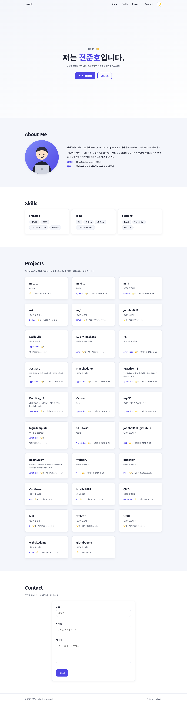
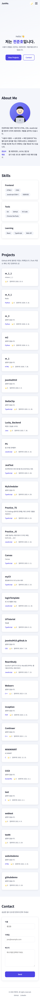
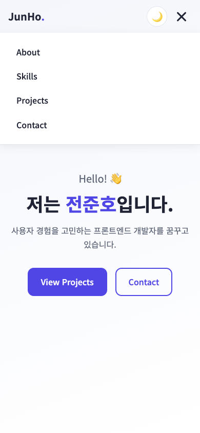
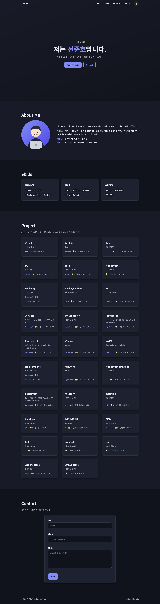

# 전준호 포트폴리오 (m_1_1)

외부 라이브러리 없이 **순수 HTML / CSS / JavaScript**만으로 만든 반응형 포트폴리오 웹사이트입니다.
"사용자 이벤트 → 상태 변경 → 화면 업데이트" 흐름을 직접 구현하는 것을 목표로 했습니다.

- **배포 URL**: https://joonho0410.github.io/m_1_1/
- **저장소**: https://github.com/joonho0410/m_1_1

## 주요 기능

| 기능 | 설명 |
| --- | --- |
| 반응형 레이아웃 | 모바일 퍼스트, 768px(태블릿) / 1024px(데스크톱) 브레이크포인트 |
| 햄버거 메뉴 | 모바일에서 버튼 클릭 시 `classList.toggle('active')`로 메뉴 열기/닫기 |
| 부드러운 스크롤 | 메뉴 클릭 시 `preventDefault()` 후 `scrollIntoView({ behavior: 'smooth' })` |
| 네비게이션 스타일 변경 | 스크롤 **60px** 이상에서 헤더 배경색/그림자 적용 (`.scrolled`) |
| 스크롤 탑 버튼 | 스크롤 **300px** 이상에서 표시, 클릭 시 맨 위로 이동 |
| 스크롤 애니메이션 | Intersection Observer, **threshold 0.2** (요소의 20%가 보이면 나타남) |
| 다크 모드 | 토글 버튼으로 전환, `localStorage`에 저장되어 새로고침 후에도 유지 |
| GitHub API 연동 | 내 저장소 목록을 카드로 렌더링 (Fork 제외, 최근 업데이트 순) |
| API 상태 UI | 로딩(스피너) / 성공(카드) / 에러(메시지 + 다시 시도) / 빈 상태 |
| 폼 유효성 검사 | 필수값·이메일 형식 검증, 필드 아래 에러 메시지, 제출 시 성공 메시지 |

## 사용 기술

- **HTML5**: 시맨틱 태그(`header`, `nav`, `main`, `section`, `article`, `footer`), 접근성 속성(`aria-*`, `label for`)
- **CSS3**: CSS 변수, Flexbox, Grid(`auto-fit` + `minmax`), 미디어 쿼리, transition / animation
- **JavaScript (ES6+)**: `const/let`, 화살표 함수, 템플릿 리터럴, 구조분해 할당, 스프레드 문법, `map/filter/forEach`, `fetch` + `async/await`, Intersection Observer, localStorage
- **외부 리소스**: Google Fonts(Noto Sans KR)만 사용
- **배포**: GitHub Pages

## 스크린샷

| 데스크톱 | 모바일 | 모바일 메뉴 |
| --- | --- | --- |
|  |  |  |

**다크 모드**



## 프로젝트 구조

```
m_1_1/
├── index.html              # 메인 페이지 (시맨틱 마크업, 모든 섹션)
├── css/
│   └── style.css           # 전체 스타일 (변수 → 공통 → 컴포넌트 → 반응형 순)
├── js/                     # 모두 defer로 로드, 적힌 순서대로 실행
│   ├── utils.js            # 공통 헬퍼: escapeHTML(XSS 방지), storage(localStorage 안전 래퍼)
│   ├── theme.js            # 다크 모드 상태 + 렌더링 + 저장
│   ├── navigation.js       # 햄버거 메뉴 토글, 부드러운 스크롤
│   ├── scroll.js           # 헤더 배경 변경, 스크롤 탑 버튼, 스크롤 애니메이션
│   ├── projects.js         # GitHub API 호출 + 로딩/성공/에러/빈 상태 렌더링
│   ├── form.js             # Contact 폼 유효성 검사
│   └── main.js             # 진입점: 각 기능의 init 함수 호출
├── images/
│   ├── profile.svg         # About 섹션 프로필 이미지
│   └── screenshots/        # README용 스크린샷
└── README.md
```

### 파일을 기능별로 나눈 이유

- 한 파일에 모든 코드를 두면 "어떤 이벤트가 어떤 상태를 바꾸는지" 찾기 어렵습니다.
  기능 단위로 나누면 파일 하나가 하나의 "상태 → 렌더링" 흐름을 담당하게 되어, 이후 React의 **컴포넌트** 개념과 자연스럽게 연결됩니다.
- 각 파일은 `initXxx()` 함수만 노출하고, 실제 실행은 `main.js`에서 한 번에 호출합니다.
- `<script defer>`는 HTML 파싱이 끝난 뒤 **작성 순서대로** 실행되므로, `utils.js`가 가장 먼저, `main.js`가 가장 마지막에 와야 합니다.

## 상태 → 렌더링 흐름

모든 인터랙션은 같은 패턴을 따릅니다: **이벤트 → 상태(state) 변경 → render 함수가 DOM 업데이트**

```
[이벤트]              [상태 변경]                        [렌더링]
테마 버튼 click   →   themeState.theme = 'dark'      →   renderTheme(): <html data-theme="dark">
                                                         → CSS 변수 교체로 전체 색상 변경
페이지 로드/재시도 →   projectsState.status            →   renderProjects(): 스피너 / 카드 / 에러 / 빈 메시지
                      'loading' → 'success'|'empty'|'error'
폼 input/submit   →   formState.values / errors      →   renderForm(): 에러 메시지·.invalid 표시/숨김,
                                                         성공 메시지 표시
```

- `setProjectsState(nextState)`는 상태를 합친 뒤 **항상** `renderProjects()`를 호출합니다. React의 `setState`와 같은 역할입니다.
- 폼 상태는 `{ ...formState, values: { ...formState.values, [name]: value } }`처럼 **새 객체를 만들어 교체**합니다. React에서 상태를 불변(immutable)하게 다루는 방식과 같습니다.
- 화면을 직접 고치지 않고 "상태만 바꾸고 render를 다시 호출"하기 때문에, 상태와 화면이 어긋나지 않습니다.

## 알아야 할 점

### 1. 시맨틱 태그를 사용한 이유와 구조 설계 기준
- `div`만 쓰면 브라우저·스크린 리더·검색 엔진이 영역의 **의미**를 알 수 없습니다. `header`/`nav`/`main`/`footer`는 랜드마크로 인식되어 스크린 리더 사용자가 바로 이동할 수 있습니다.
- 설계 기준
  - 페이지 공통 상단 → `<header>`, 그 안의 주요 링크 묶음 → `<nav>`
  - 페이지 고유 콘텐츠 → `<main>` (페이지에 하나)
  - 제목(`h2`)을 가진 주제 단위 → `<section>` (Hero, About, Skills, Projects, Contact)
  - 독립적으로 떼어내도 의미가 있는 단위 → `<article>` (스킬 카드, 프로젝트 카드)
  - 제목 계층은 `h1`(Hero 1개) → `h2`(섹션) → `h3`(카드) 순으로 건너뛰지 않습니다.
- 모든 이미지에 의미 있는 `alt`, 모든 입력에 `<label for="id">`를 연결했습니다. (라벨 클릭 시 입력에 포커스되는 것으로 확인 가능)

### 2. Flexbox vs Grid
| | Flexbox | Grid |
| --- | --- | --- |
| 방향 | **1차원** (가로 또는 세로 한 줄) | **2차원** (행과 열 동시) |
| 기준 | 콘텐츠 크기에 맞춰 배치 | 레이아웃(격자)을 먼저 정하고 콘텐츠를 배치 |
| 이 프로젝트 | 네비게이션(로고 왼쪽 / 메뉴 오른쪽), 버튼 그룹, 태그 목록, 푸터 | Projects 카드, Skills 카드 |

- Projects 카드: `grid-template-columns: repeat(auto-fit, minmax(260px, 1fr))`
  → 카드가 최소 260px을 유지할 수 있는 만큼 열이 자동으로 생깁니다. 미디어 쿼리 없이도 모바일 1열 → 태블릿 2열 → 데스크톱 3열이 됩니다.

### 3. CSS 변수와 다크 모드
- `:root`에 색상·폰트·간격을 변수로 정의하고, `[data-theme="dark"]`에서 **색상 변수만** 다시 정의합니다.
- JS는 `<html>`의 `data-theme` 속성 하나만 바꾸고, 실제 색 변경은 CSS가 담당합니다. (역할 분리)
- 모바일 퍼스트: 기본 스타일이 모바일이고, `@media (min-width: 768px)`, `@media (min-width: 1024px)`로 넓은 화면 스타일을 **덧붙입니다**.

### 4. DOM 선택 → 이벤트 연결 흐름
```js
const button = document.querySelector('#theme-toggle');   // 1) 요소 선택
button.addEventListener('click', () => {                    // 2) 이벤트 연결
  setTheme(themeState.theme === 'dark' ? 'light' : 'dark'); // 3) 상태 변경 → 렌더링
});
```
- HTML에 `onclick`을 쓰지 않고 `addEventListener`를 사용 → HTML(구조)과 JS(동작)를 분리하고, 한 요소에 여러 핸들러를 붙일 수 있습니다.
- 다룬 이벤트: `click`, `submit`, `scroll`, `input`, `focusout`
- `event.preventDefault()`: 앵커의 즉시 점프(부드러운 스크롤 대체), 폼 제출 시 페이지 새로고침을 막습니다.
- **이벤트 위임**: 폼은 각 input마다가 아니라 `<form>` 하나에 `input` 리스너를 달고 `event.target.name`으로 필드를 구분합니다.
- 에러 상태의 "다시 시도" 버튼은 `innerHTML`로 **매번 새로 만들어지므로**, 렌더링할 때마다 이벤트를 다시 연결합니다.

### 5. ES6+ 문법을 쓰는 이유
- **화살표 함수**: 짧은 콜백(`repos.filter(({ fork }) => !fork)`)을 간결하게 작성
- **구조분해 할당**: 필요한 값만 꺼내 의도를 드러냄 (`const { name, value } = event.target`, 카드 함수의 매개변수)
- **템플릿 리터럴**: `${}`로 데이터를 끼워 넣어 HTML 문자열을 읽기 쉽게 생성
- **map**: 데이터 배열 → HTML 문자열 배열 (`projects.map(createProjectCard).join('')`)
- **filter**: 조건에 맞는 것만 남김 (Fork 저장소 제외)
- **forEach**: 순회하며 부수 효과 실행 (요소마다 이벤트 등록, observer 등록)

### 6. fetch + async/await, 그리고 상태 UI
```js
setProjectsState({ status: 'loading' });            // 스피너 표시
try {
  const response = await fetch(url);
  if (!response.ok) throw new Error(...);           // ⚠️ fetch는 403/404에서도 reject되지 않는다!
  const repos = await response.json();
  setProjectsState({ status: repos.length ? 'success' : 'empty', projects: repos });
} catch (error) {
  setProjectsState({ status: 'error', errorMessage: ... }); // 에러 메시지 + 다시 시도 버튼
}
```
- `fetch`는 **네트워크 실패에서만** reject됩니다. 403/404 같은 HTTP 에러는 `response.ok`로 직접 확인해야 합니다.
- **GitHub API 레이트 리밋**: 인증 없이 **시간당 60회**로 제한됩니다. 초과 시 403 응답 → "요청 한도 초과" 에러 UI가 표시됩니다. 개발 중 짧은 시간에 새로고침을 반복하지 않도록 주의하세요.
- GitHub에서 받은 저장소 설명 등 **외부 데이터는 `escapeHTML()`을 거친 뒤 `innerHTML`에 넣습니다.** 이스케이프하지 않으면 설명에 들어 있는 HTML이 그대로 실행될 수 있습니다(XSS). 단순 텍스트는 `textContent`를 사용합니다.
- GitHub 사용자명은 `js/projects.js`의 `GITHUB_USERNAME` 상수에서 변경할 수 있습니다.

### 7. 폼 유효성 검사 UX
- `<form novalidate>`로 브라우저 기본 말풍선 대신 직접 만든 에러 메시지를 사용합니다.
- 사용자가 아직 건드리지 않은 필드에는 에러를 보여주지 않고(`touched`), 포커스를 벗어나거나 제출할 때부터 표시합니다.
- 제출 시 에러가 있으면 첫 번째 에러 필드로 포커스를 이동합니다.
- 이메일 검증 정규식: `/^[^\s@]+@[^\s@]+\.[^\s@]+$/`
- 실제 메일 전송은 하지 않습니다(보너스 과제 범위). 검증 통과 시 폼을 초기화하고 성공 메시지만 표시합니다.

### 8. 기준값 정리
| 항목 | 값 | 위치 |
| --- | --- | --- |
| 헤더 배경 변경 | 스크롤 60px | `js/scroll.js` `HEADER_SCROLL_THRESHOLD` |
| 스크롤 탑 버튼 표시 | 스크롤 300px | `js/scroll.js` `SCROLL_TOP_THRESHOLD` |
| 스크롤 애니메이션 | threshold 0.2 | `js/scroll.js` `REVEAL_THRESHOLD` |
| 브레이크포인트 | 768px, 1024px | `css/style.css` 미디어 쿼리 |
| 다크 모드 저장 키 | `theme` | `js/theme.js` `THEME_STORAGE_KEY` |

### 9. 코드 규칙
- `var` 미사용 (`const` 기본, 재할당 필요 시 `let`)
- HTML `onclick` 미사용 → `addEventListener`
- 인라인 스타일(`style="..."`) 미사용 → 상태는 클래스(`active`, `scrolled`, `visible`, `is-visible`, `invalid`)로 표현
- 외부 라이브러리 미사용 (Google Fonts만 사용)

## 실행 방법

### 로컬 개발 (VS Code + Live Server)
1. VS Code에서 프로젝트 폴더를 엽니다.
2. 확장 프로그램 **Live Server**를 설치합니다.
3. `index.html`에서 우클릭 → **Open with Live Server** (기본 `http://127.0.0.1:5500`)
4. 파일을 저장하면 브라우저가 자동으로 새로고침됩니다.

> `index.html`을 파일로 직접 여는(`file://`) 것보다 Live Server 같은 로컬 서버로 여는 것을 권장합니다.

### GitHub Pages 배포
1. 변경 사항을 `main` 브랜치에 push 합니다.
2. GitHub 저장소 → **Settings → Pages**
3. Source: **Deploy from a branch**, Branch: **main / (root)** 선택 후 Save
4. 1~2분 후 https://joonho0410.github.io/m_1_1/ 에서 확인합니다.
